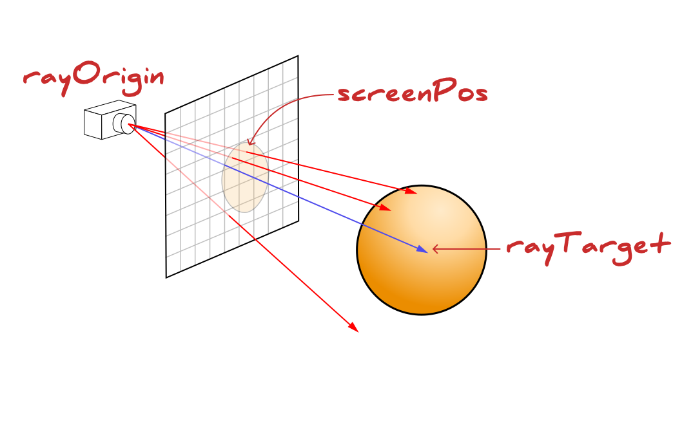
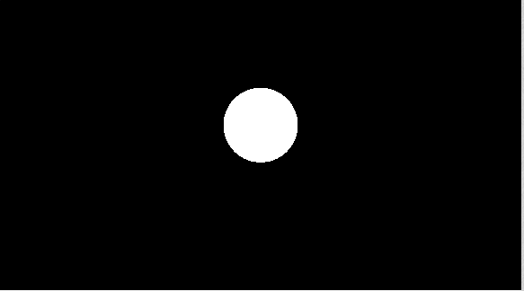

# Raymarching-Experiments
[shaderToy Project](https://www.shadertoy.com/view/sf2XWd)

J'ai voulu tester de reproduire des effets visuel codé avec des shaders nottament pour creer des objets 3D,
des effets visuel comme de la lumière réaliste, de la diffusion lumineuse, du [Raymarching](https://fr.wikipedia.org/wiki/Ray_marching), raytracing....

Ici les projets utilisent du Raymarching qui est une technique consotant a projeter des rayons depuis la 
camera jusqu'à trouver une surface mais sans connaitre la position de la surface.



Le projet se compose de plusieurs sous projets qui sont créé avec [ShaderToy](https://www.shadertoy.com/)
Les shaders sont des scripts qui sont executé pour chacun des pixels de l'écran, executé par la carte graphique
en parallèle.

# Sphere with Raymarching
Ce projet est une simple sphere et un plane éclairé par une lumière qui se deplace.
La technique ici consiste à tirer des rayons depuis une caméra et à voir quand il arrive a une certaine distance 
d'un objet, a ce moment on considère le pixel comme valide et on peut afficher une couleur. (Raymarching)
L'affichage d une sphere est simple, on affiche une sphere en 2d en calculant la distance point à la position de la 
sphère et en avancant de cette distance.

```
float RayMarch(vec3 pos, vec3 dir)
{
    int maxStep = 300;
    float maxDistance = 300.0;    
    float distance = 0.0;
    for (int i = 0; i < maxStep; i++)
    {
        float dstFromObject = sdf(pos + (dir*distance)).x;
        if (dstFromObject < 0.01) return distance;//touché
        if (distance > maxDistance) break;
        distance += dstFromObject;
        
    }
    
    return -1.0;
}
```
Si la valeur est negative on retourne une couleur noir et du blanc sinon, c'est la couleur de la sphere.
Elle apparait en 2d on peut passer a la lumiere pour avoir la 3D



Après l'affichage de la couleur on peut calculer la lumiere:


Cette formule nous donne une intensité de lumiere avec la normale de la surface touché et le vecteur de la lumière
on fait `dot(lightVector,normal)`. Il suffit de clamp la valeur pour ne pas avoir des valeurs extreme.
Pour calculer la normal on prend la fonction de calcul de normal a partir des coordonnées et des distance de notre
signed distance field
```
vec3 GetNormal(vec3 p)
{
     vec2 e = vec2(.01,0);
     float d  = sdf(p).x;
     vec3 n = vec3(
         d - sdf(p-e.xyy).x,
         d - sdf(p-e.yxy).x,
         d - sdf(p-e.yyx).x
     );
     
     return normalize(n);
}
```
Ensuite pour les ombres on renvoie un rayon depuis le point d impact vers la lumiere et si c'est obstrué on affiche une valeur sombre,
j'ai mis la valeur proportionnel a la distance parcouru pour avoir des ombres plus douces sur les bords.

# Volumetric Clouds
[shaderToy Project](https://www.shadertoy.com/view/f3X3Dr)


$$
L = \int_0^D T(t)\cdot\sigma_s \cdot L_{\text{in}}(t)\space dt \approx \sum_{i} T_i \cdot \sigma_s \cdot\Delta t\cdot L_{\text{in}}(p_i)
$$
